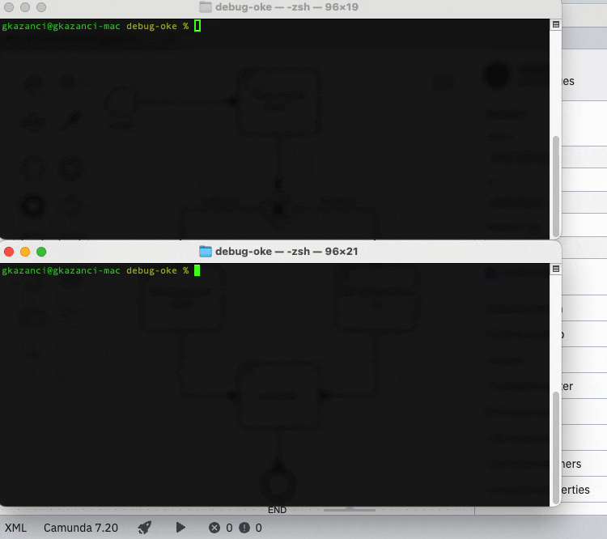
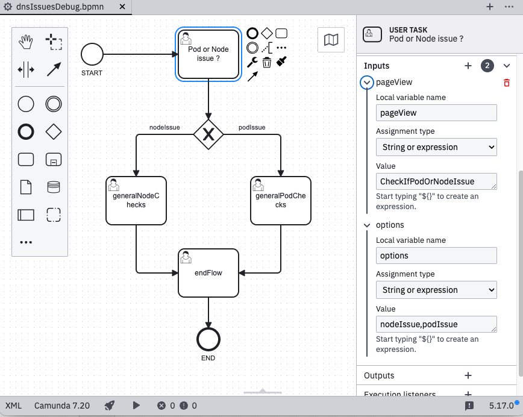

# Camunda Flow UI

## Introduction
This frontend project is developed with [React](https://react.dev) in [Typescript](https://www.typescriptlang.org/). It uses [material-ui](https://mui.com/material-ui/all-components/) components.

The main purpose is to create a generic user interface to run [Camunda](https://camunda.com) bpmn flows and interact with the buttons on the frontend to navigate through the defined process. 




BPMN file should be designed in a way that the frontend expects to find. For instance, user tasks should maintain 2 input parameters.
* **pageView** : This should give the react component name to display. The react component must be located under *src/process/${processDefinitionName}*
* **options** : This should give the button list to navigate in a comma separated format.



If **options** are given empty, frontend displays a default button **Next** to move one.

## How to run it
Download **camunda 7 community edition** from [camunda website](https://camunda.com/download/platform-7/).

Untar downloaded file and update **camunda-bpm-run-7.21.0/configuration/default.yaml** to set **camunda.bpm.run.cors** parameters as below. This is required for running backend and frontend from different ports on localhost.
```yaml
camunda.bpm:
  run:
    cors:
      enabled: true
      allowed-origins: "*"
      allowed-headers: "access-control-allow-methods, access-control-allow-origin, Origin, Accept, X-Requested-With, Content-Type, Access-Control-Request-Method, Access-Control-Request-Headers, Access-Control-Allow-Origin"
      preflight-maxage: 1800
```
Use the script in downloaded camunda folder to start camunda.
```shell
./start.sh 
```
After cloning the project at your local, run below commands to start flow-ui.
```shell
cd camunda-flow-ui
npm install
npm start
```
You need to deploy the sample bpmn file in order to test it.
```shell
cd bpmn-flows
curl -H "Content-Type: multipart/form-data" -H "Connection: keep-alive" -F "deployment-name=dnsIssues" -F "deployment-source=dnsIssues" -F "*=@dnsIssues.bpmn" http://localhost:8080/engine-rest/deployment/create
```
